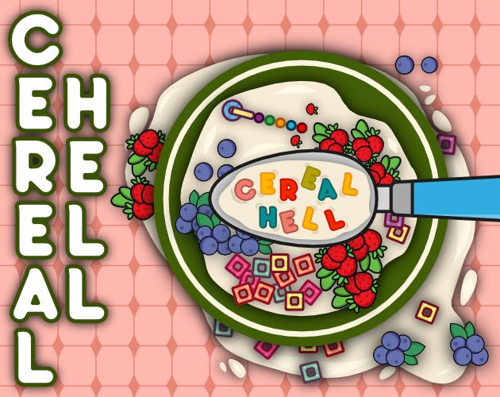

# Cereal Hell

Cereal Hell is a game jam game made for Bullet Hell Jam 7 Hosted by Harman Kamboj, theChief

The theme of the jam was "SHRINK". I don't know why but the first thing that came to my mind was a cereal bowl so I went with that.

I don't think most of us realize how cruel and savage the world inside this bowl can be :) ...this is a game of survival of the fittest. Kill the other cereal and come out on top. Good Luck! :D

---
CONTROLS (Twin Stick Shooter)

- WASD/Arrow - Movement
- Mouse - Aim
- Left Click - Shoot

- Esc - Pause/UnPause
- R - Restart (In pause, game over or win screen)
- M - Main Menu (In pause, game over or win screen)

---
CREDITS

- Language: Odin
- Library: Karl2D
- Visuals: Affinity Designer
- Editor: Focus
- Ref: PureRef
- Audio: OpenGameArt, Pixabay

...and a lot of coffee of course :D

Check out the game on [itch](https://yordanos.itch.io/cereal-hell)